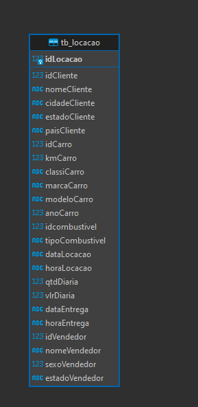
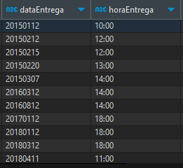
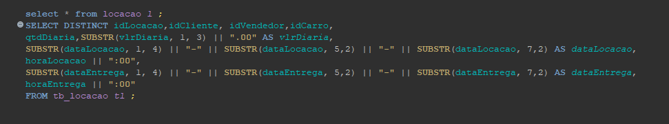
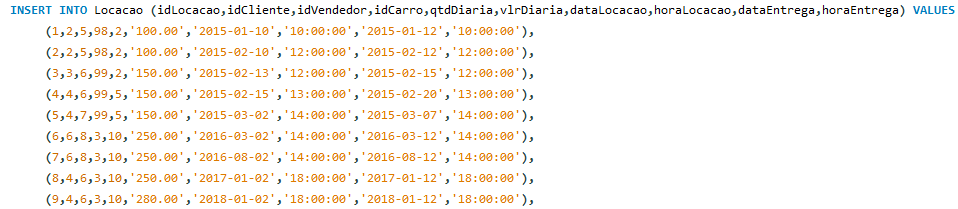
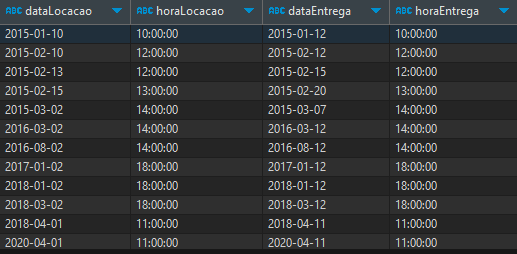
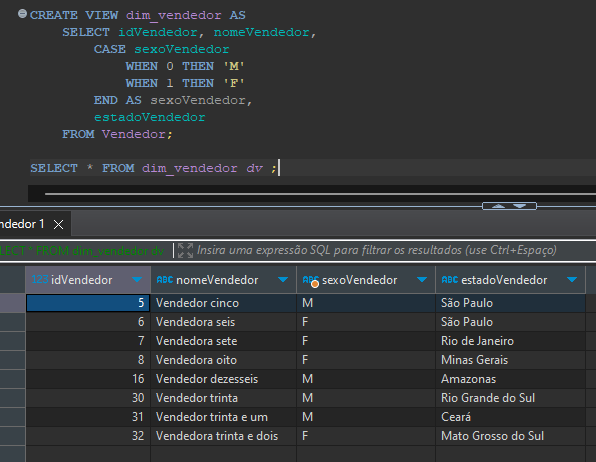
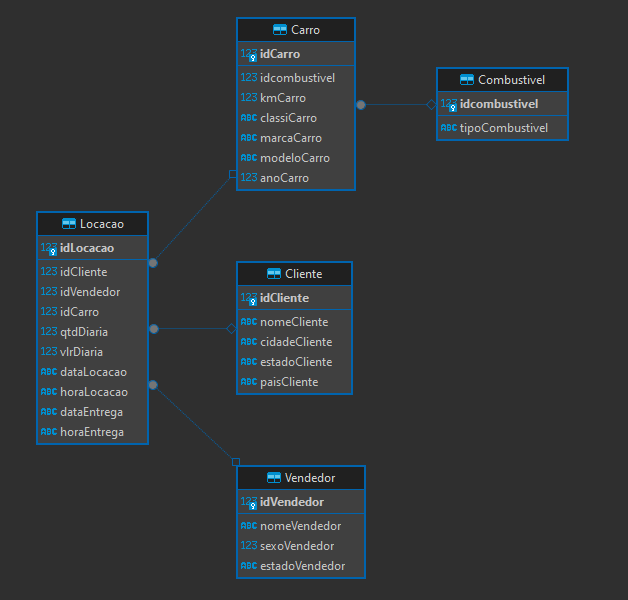
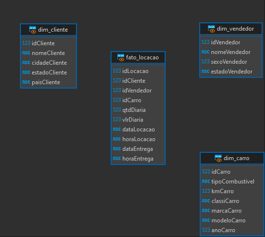

# Relational and Dimensional Data Modeling with SQL

This repository contains hands-on exercises and practical applications of Relational Databases and SQL. The main goal of this project was to perform data normalization, data cleaning, and construct both relational and dimensional models.

## Key Skills & Technologies Demonstrated
* **Database Management:** SQLite, DBeaver
* **SQL Queries:** `SELECT`, `JOIN`, `VIEW`, `DISTINCT`, Data Export
* **Data Cleaning & Transformation:** String manipulation (`SUBSTR`), conditional logic formatting.
* **Data Modeling:** Normalization, Entity-Relationship (ER) Modeling, Dimensional Modeling (Star Schema).

---

## Project Evidence & Step-by-Step Implementation

**1. Initial Data Analysis** After extracting the raw database (`concessionaria.sqlite`), I used DBeaver to analyze the structure and identify areas that required normalization.

**2. Data Quality Check** By executing queries like `SELECT * FROM tb_locacao LIMIT 15;`, I identified that the `DATE` and `TIME` attributes were not properly formatted.

**3. Data Cleaning & Transformation** To fix the formatting issues, I applied the `SUBSTR` function to correct the date structures. For the time attributes, I used string concatenation to append seconds, ensuring standard time formats.

**4. Preventing Data Duplication** During data insertion into the normalized tables, I utilized the `SELECT DISTINCT` statement to guarantee unique records before exporting and migrating the data.

Below is the result showing the properly formatted and inserted data:

**5. Creating Views with Conditional Logic** I created a `VIEW` (`dim_vendedor`) utilizing simple conditional logic to make the data more intuitive. For example, transforming binary gender indicators (0 and 1) into readable formats (M or F).

**6. Relational Model** The final normalized structure of the database represented in a Relational Model.

**7. Dimensional Model (Star Schema)** The final Dimensional Model following a *Star Schema* architecture, featuring the fact table containing numeric attributes at the center, surrounded by dimension tables with descriptive attributes.

---

## SQL Exercises & Case Studies

Below is the list of queries developed for the case studies:

* [Query Ex1](exercicios/ex1.txt) | [Query Ex2](exercicios/ex2.txt) | [Query Ex3](exercicios/ex3.txt) | [Query Ex4](exercicios/ex4.txt)
* [Query Ex5](exercicios/ex5.txt) | [Query Ex6](exercicios/ex6.txt) | [Query Ex7](exercicios/ex7.txt) | [Query Ex8](exercicios/ex8.txt)
* [Query Ex9](exercicios/ex9.txt) | [Query Ex10](exercicios/ex10.txt) | [Query Ex11](exercicios/ex11.txt) | [Query Ex12](exercicios/ex12.txt)
* [Query Ex13](exercicios/ex13.txt) | [Query Ex14](exercicios/ex14.txt) | [Query Ex15](exercicios/ex15.txt) | [Query Ex16](exercicios/ex16.txt)

### Data Export Exercises
* **Step I:** [Extracted CSV](exercicios/exercicio2_expotacao_de_dados/Etapa1.csv) | [SQL Query](exercicios/exercicio2_expotacao_de_dados/query_etapa1.txt)
* **Step II:** [Extracted CSV](exercicios/exercicio2_expotacao_de_dados/Etapa2.csv) | [SQL Query](exercicios/exercicio2_expotacao_de_dados/query_etapa2.txt)

---

## Certifications
* AWS Partner Sales Accreditation (Business)

## Learnings
Throughout this project, I consolidated my understanding of how a well-structured database impacts the performance and reliability of data analysis. Transitioning from raw data to a fully functional Star Schema provided solid hands-on experience in business intelligence foundations.
